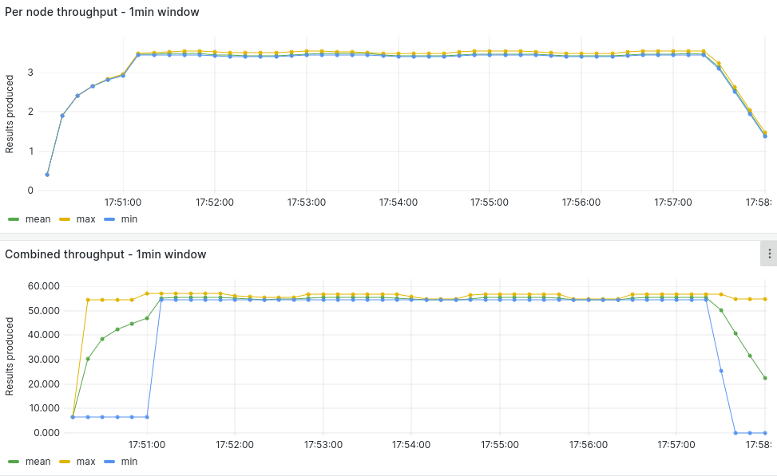
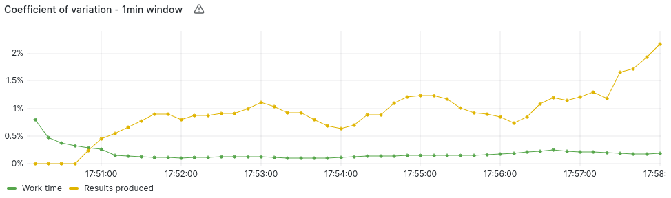
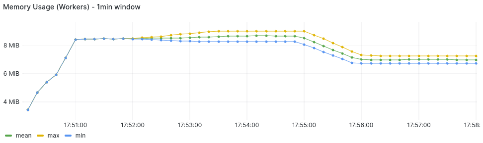
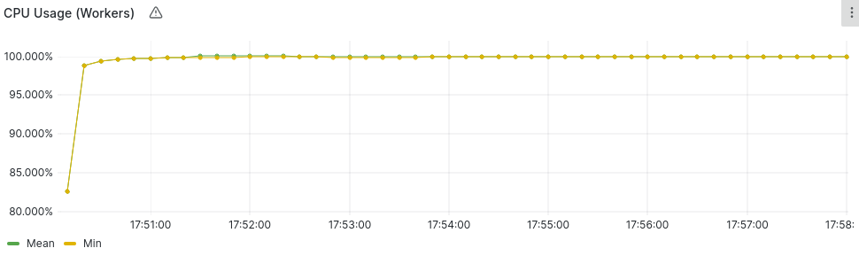

### 16 Nodes Measurements

#### Average Summary

- Worker Throughput: 3.42 Results/Second
- Combined Throughput: 55.5 Results/Second
- Work-time Variation: 0.12%
- Memory Usage: 7.0-8.4 MB/Worker
- CPU Usage: 99.9%/Worker (?)
- Completion Time: 7.3 Minutes

#### [Measurements](https://snapshots.raintank.io/dashboard/snapshot/C2kuefMy4HgQxil0VR91KYcwDUW0dlAg?orgId=2)

