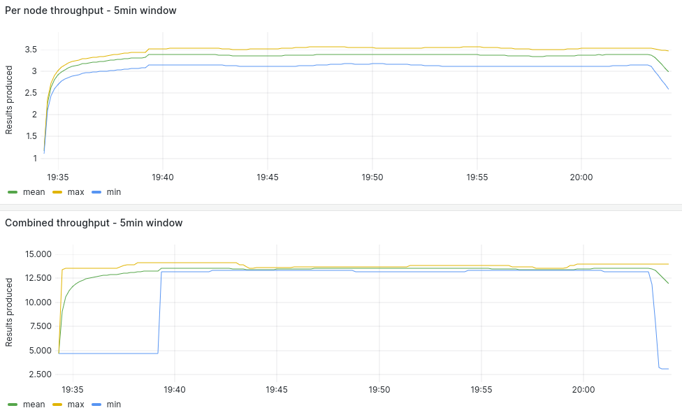
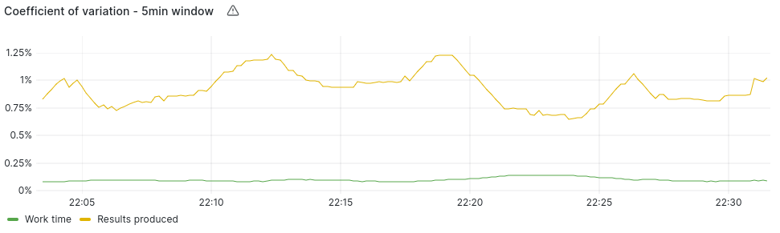
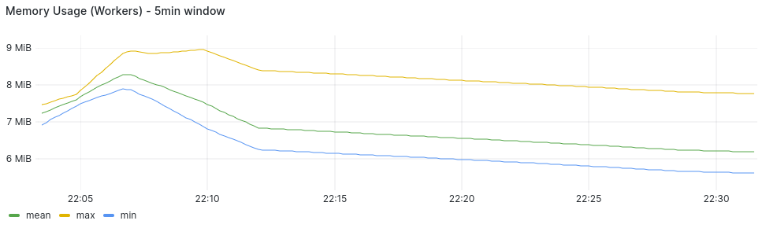
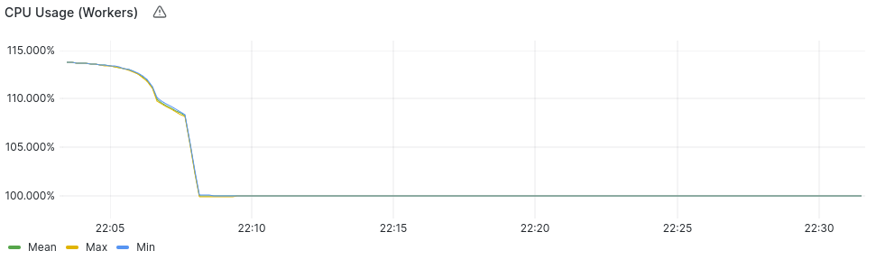

### 4 Nodes Measurements

#### Average Summary

- Worker Throughput: 3.37 Results/Second
- Combined Throughput: 13.53 Results/Second
- Work-time Variation: 4.5%
- Memory Usage: 3.5-4.5 MB/Worker
- CPU Usage: 99.9%/Worker (?)
- Completion Time: 31.6 Minutes

#### [Measurements](https://snapshots.raintank.io/dashboard/snapshot/d0Ms6kje7P9hhvKu0O4bx6xS05sgDd2r?orgId=2)

