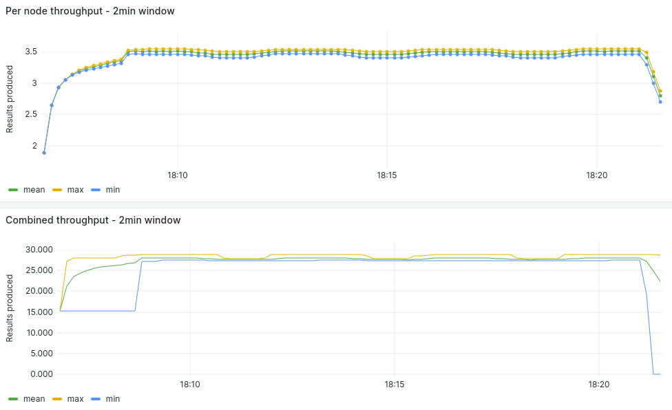
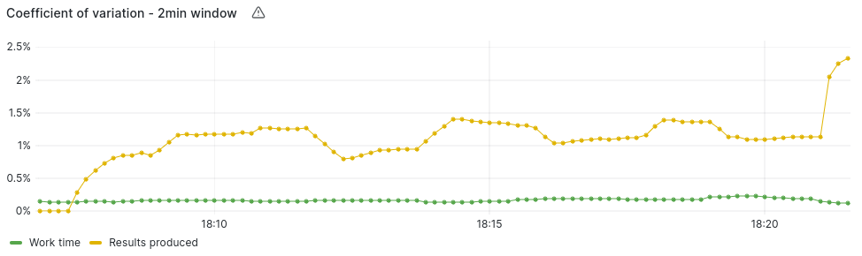
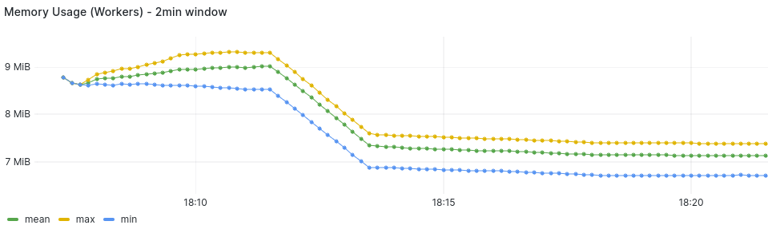
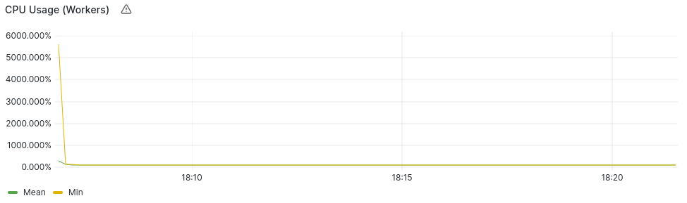

### 8 Nodes Measurements

#### Average Summary

- Worker Throughput: 3.45 Results/Second
- Combined Throughput: 28.00 Results/Second
- Work-time Variation: 0.16%
- Memory Usage: 7-9 MB/Worker
- CPU Usage: 99.9%/Worker (?)
- Completion Time: 14.5 Minutes

#### [Measurements](https://snapshots.raintank.io/dashboard/snapshot/7l0BQLfcXDkBdA1UtFJmAUgmVZCK1jD4)

